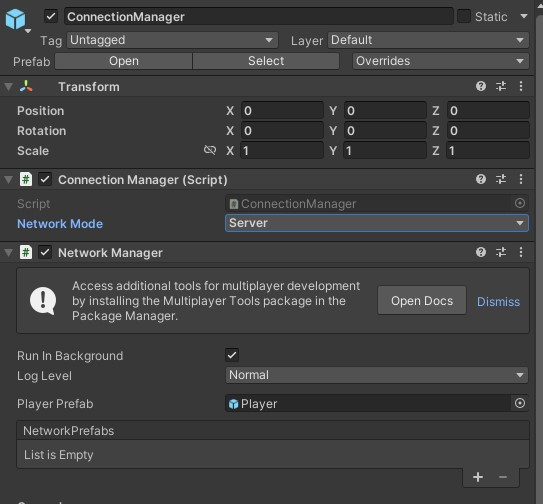

# HoloLen LSL Netcode

## Build and Run

### Prerequisite
- `Unity` version `2021.3.4f1` installed.
- `Visual Studio 2019` installed.
- `Git` installed and added to the Path.
- [LSL LabRecorder](https://github.com/labstreaminglayer/App-LabRecorder/releases) installed.

### Importing Packages
- Use [Mixed Reality Feature Tool](https://learn.microsoft.com/en-us/windows/mixed-reality/develop/unity/welcome-to-mr-feature-tool) to import the packages. You can use the `Restore Features` button in the feature tool app to add the required packages.
- Follow [this guide](https://github.com/microsoft/Azure-Kinect-Samples/tree/master/body-tracking-samples/sample_unity_bodytracking) to copy the required `dll` to set up kinect sdk.

### Running on HoloLens Instructions
- Open the `HoloLens_LSL` scene from `Assets/LSL Hololens/Scenes`
    - In ConnectionManager game object, enter IP address of HoloLens and set "Network Mode" as Server. To get the IP address from Hololens, go into `Settings (tap icon on wrist) -> Update & Security -> For developers -> scroll to “Connect using: Wi-Fi“`

         
    - Disable LSL game object.
    
        
    - Enable Gaze Cursor script in the Sphere game object.
    
        
    - Disable BodyTracker and Kinect4AzureTracker game objects.

        
        
    - Change the XR Plugin settings by going to `File -> Build Settings -> Player Settings -> XR Plug-in Management -> check Initialize XR on Startup and OpenXR.`
    - Switch platform to Universal Windows Platform by `File -> Build Settings -> Universal Windows Platform > Swtich Platform `
    - Build and Run the app on Hololens by `File -> Build Settings -> Add Open Scenes -> Universal Windows Platform -> Build and Run `. Follow the below image for the build settings.
        
        

### Running on PC Instructions
- Open the `HoloLens_LSL` scene from `Assets/LSL Hololens/Scenes`
    - In ConnectionManager game object, enter IP address of HoloLens and set "Network Mode" as Client. To get the IP address from Hololens, go into `Settings (tap icon on wrist) -> Update & Security -> For developers -> scroll to “Connect using: Wi-Fi“`
    
         
    - Enable LSL game object.
    
        
    - Disable Gaze Cursor script in the Sphere game object. 
    
        
    - Enable BodyTracker and Kinect4AzureTracker game objects.

        
        
    - Press the `Play` button in the scene to run the app. 

        
    - Open LabRecorder, check `Holo_LSL` stream, and press Start. 

        
    - To view the generated XDF file:
        - **Converting to CSV:** Convert the xdf file to CSV using https://github.com/HCI-UD/XDF-to-CSV
        - **Using SigViewer:** Open Sigviewer and open the most recent xdf file. https://github.com/cbrnr/sigviewer
        - **Other viewers:** for the .xdf file https://labstreaminglayer.readthedocs.io/info/viewers.html 

## Data Collected
LSLSampleStream script tracks the follwoing data:
- Headset Position Tracking from Hololens
    - headset position (represented by white sphere game object) is streamed x, y, z through channels 0-2
- Headset Rotation Tracking
    - LSLSampleStream script tracks headset rotation (Euler Angles) then streams the x, y, z through channels 3-5
- Eye Gaze Position Tracking
    - LSLSampleStream script tracks sphere position then streams the x, y, z through channels 6-8
- Body Tracking from Azure Kinect
    - LSLSampleStream script tracks body positions (modeled with the point body in  Kinect4AzureTracker game object) then streams the x, y, z 
        - Torso, Neck, Left Knee, Right Knee, Left Elbow, Right Elbow, Left Hand, Right Hand

